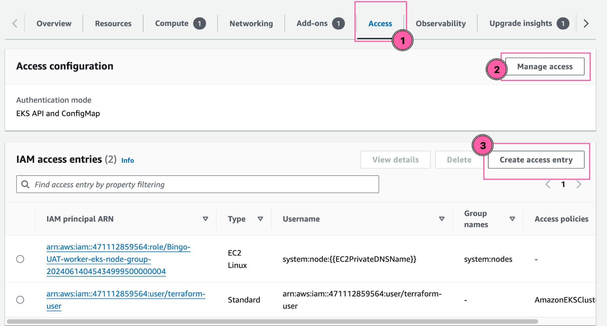
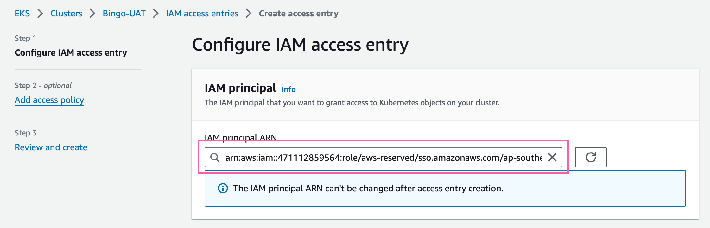
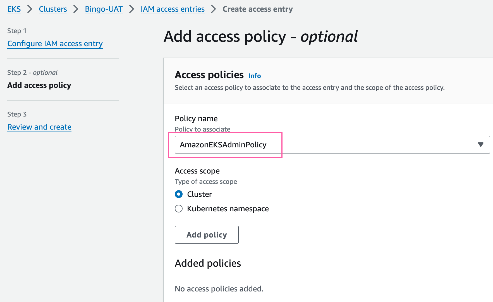

# How to use this code
This terraform template is used to automate your own terraform.
### Code Behaviour
The code will deploy a codepipeline + codebuild in AWS which will first detect any changes in your _main_ branch and deploys the resources.

Below is the step-by-step guide to use this terraform code.

## Prerequisites:
- terraform
- kubectl
- aws sso credentials

## Step 1: Create the s3 bucket
Terraform needs to store the tfstate in s3. So we have to create the s3 bucket (manually) on its own first.
1. `cd modules/s3-bucket`
2. change the values in _variables.tf_
3. `terraform init`, `terraform plan`, `terraform apply` - s3 bucket is now created
4. `cd` back to root directory
5. to store tfstate in s3: add this config below at the beginning of your main.tf (change the values)
```sh
terraform {

  backend "s3" {
    profile = "[your aws profile name]"
    bucket  = "[s3-bucket-name]"
    region  = "[region]"
    key     = "state/terraform.tfstate"  ###path in the s3 bucket
  }
}
```

## Step 2: GitHub Connection
Go to `scripts` directory.
Change these values in _./scripts/codestar.sh_
```sh
# Variables
profile="[the aws profile in your local]"
provider_type="GitHub"
connection_name="[put a unique name for your github connection]"
```
- Run the _codestar.sh_ script, then the arn of the github connection will be in _codestar-arn.json_ file.  
- Copy and paste that arn into ./terraform.tfvars `SOURCE_CONNECTION_ARN`
- Then, go to **AWS Console -> CodePipeline -> Settings -> Connections -> Update pending connection**
- If it's your first time connecting to Git, click **Install New App** and follow the steps to insert your Git repo. <br>

:exclamation: Important note: if you are not the _repo/organization owner_, you may encounter permission error. Please ask your manager to assist update the pending connection.

## Step 3: terraform.tfvars
- Go back to the root directory
- Change the values in _./terraform.tfvars_ to suit your needs

## Step 4: TF Apply
- In root directory, `terraform init`, `terraform plan`, `terraform apply` and wait for it to build up the CodePipeline and CodeBuild stuff 
- :exclamation:(FYI modify the CodeBuild scripts in _modules/codebuild-plan_ or _modules/codebuild-apply_ to fit your own code)

## Step 5: Subscribe to SNS Topic
- After the CodePipeline is deployed, check your email and accept the _Subscription Confirmation_ <br>
<br>

# -- Modify Access after deploying EKS Cluster --
We need to do this so that the eks cluster can be accessed by our iam role <br>
- Go to EKS cluster --> Access --> Manage access
1. and 2. Change the Access configuration to _EKS API and ConfigMap_


2. next, change IAM principal to your Admin SSO arn

- Add the exact same arn into the _Username (optional)_ below <br>

:point_right: example: arn:aws:iam::471112859564:role/xxx/AWSReservedSSO_AdministratorAccess_123/

3. click Next, and add AmazonEKSAdminPolicy


4. save and done 
